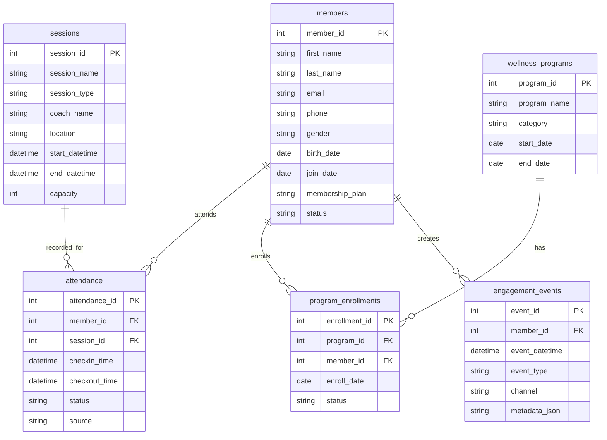

# ERD (Operational)

```mermaid
erDiagram
    members ||--o{ attendance : attends
    sessions ||--o{ attendance : recorded_for
    members ||--o{ program_enrollments : enrolls
    wellness_programs ||--o{ program_enrollments : has
    members ||--o{ engagement_events : creates

    members {
        int member_id PK
        string first_name
        string last_name
        string email
        string phone
        string gender
        date   birth_date
        date   join_date
        string membership_plan
        string status
    }
    sessions {
        int session_id PK
        string session_name
        string session_type
        string coach_name
        string location
        datetime start_datetime
        datetime end_datetime
        int capacity
    }
    attendance {
        int attendance_id PK
        int member_id FK
        int session_id FK
        datetime checkin_time
        datetime checkout_time
        string status
        string source
    }
    wellness_programs {
        int program_id PK
        string program_name
        string category
        date start_date
        date end_date
    }
    program_enrollments {
        int enrollment_id PK
        int program_id FK
        int member_id FK
        date enroll_date
        string status
    }
    engagement_events {
        int event_id PK
        int member_id FK
        datetime event_datetime
        string event_type
        string channel
        string metadata_json
    }
```

See analytics star schema in `docs/analytics_schema.md`.
